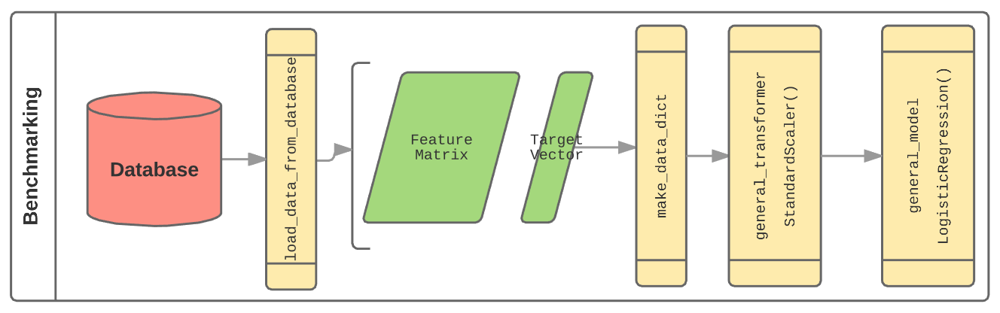
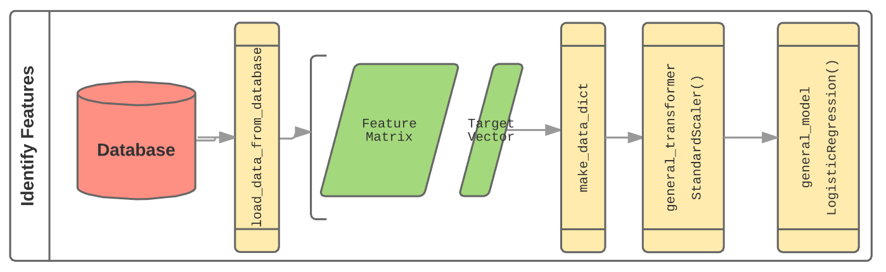
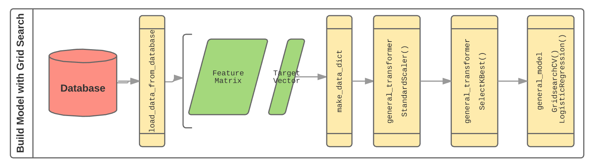

 

Project 5: Exploring Madelon
----

### Overview

This week, you've learned about access and utilizing remote databases, and more advanced topics for conducting logistic regression, selecting features, and building machine learning pipelines. Now, let's put these skills to the test!

You're working as a data scientist with a research firm. You're firm is bidding on a big project that will involve working with thousands or possible tens of thousands of features. You know it will be impossible to use conventional feature selection techniques. You propose that a way to win the contract is to demonstrate a capacity to identify relevant features using machine learning. Your boss says, "Great idea. Write it up." You figure that working with the [Madelon](https://archive.ics.uci.edu/ml/datasets/Madelon) synthetic dataset is an excellent way to demonstrate your abilities. 

A data engineer colleague sets up a remote PostgreSQL database for you to work with. You can connect to that database at `joshuacook.me:5432` with user `dsi` and password "`correct horse battery staple`". You can connect via command line using

	$ psql -h joshuacook.me -p 5432 -d dsi -U dsi_student
	
and entering the password when prompted

(Optional) You tell your colleague, thanks, but you prefer to run your database locally using docker. 

Regardless of whether you use the remote database or Docker, your colleague encourages you to use `sqlalchemy` to connect postgres to pandas. He suggests that the following code might be useful but seems distracted and rushed and tells you to check stack when you push for more:

    engine = create_engine("postgresql://{}:{}@{}:{}/{}".format(user, password, url, port, database))

### Problem Statement

Your challenge here is to implement three machine learning pipelines designed to demonstrate your ability to select salient features programatically. 

### Solution Statement

Your final product will consist of:

1. A prepared report
2. Three Jupyter notebooks to be used to control your pipelines
3. A library of python code you will use to build your pipelines

##### Pipeline 1: Benchmarking

##### Pipeline 2: Select Features with $\ell1$-Penalty

##### Pipeline 3: Build Model with Grid Search

### Tasks

##### Prepared Report

Your report should
1. be a pdf
2. include a well-posed problem statement with Domain, Data, Problem, Solution, Metric, Benchmark
3. optionally include EDA & Data Description
4. present results from Step 1 - Benchmarking
5. present results from Step 2 - Identify Salient Features
6. present results from Step 3 - Build Model
7. compare results obtained by LogisticRegression and KNearestNeighbors in Step 3
8. present compare features identified as important by Step 2 and Step 3
9. recommend feature engineering steps for a potential next phase in project

##### Jupyter Notebook 1, Step 1 - Benchmarking
1. build pipeline to perform a naive logistic regression as a baseline model
	- in order to do this, you will need to set a high `C` value in order to perform minimal regularization

##### Jupyter Notebook, Step 2 - Identify Features
1. build pipeline with `LogisticRegression` using l1 penalty
2. use constructed model to identify important features

##### Jupyter Notebook, Step 3 - Build Model
1. construct a Pipeline that uses `SelectKBest` to transform data
2. construct a Pipeline that uses `LogisticRegression` to model data
3. construct a Pipeline that uses `KNearestNeighbors` to model data
4. Gridsearch optimal parameters for logistic regression and KNN

##### Library of Python Code
1. write docstrings for all wrapper function that describe inputs and outputs
1. write wrapper function to connect remote datasource to pandas
    - receives database information
	- queries and sorts data
	- returns a dataframe
2. write wrapper function to split data into a dictionary object to be passed through pipeline
	- receives a dataframe and a random state
	- performs train test split
	- returns a data dictionary containing all necessary data objects
4. Write wrapper function to perform a general transformation on data
	- receives a data dictionary
	- fits on train data
	- transforms train and test data
	- return a data dictionary with updated train and test data and transformer
5. Write wrapper function to build a general model using data
	- receives a data dictionary
	- fits on train data
	- scores on train and test data
	- return a data dictionary adding model and scores 	

---

### Requirements

- A local PostgreSQL database housing your remote data.
- A Jupyter Notebook with the required problem statement, goals, and technical data.
- A written report of your findings that detail the accuracy and assumptions of your model.

